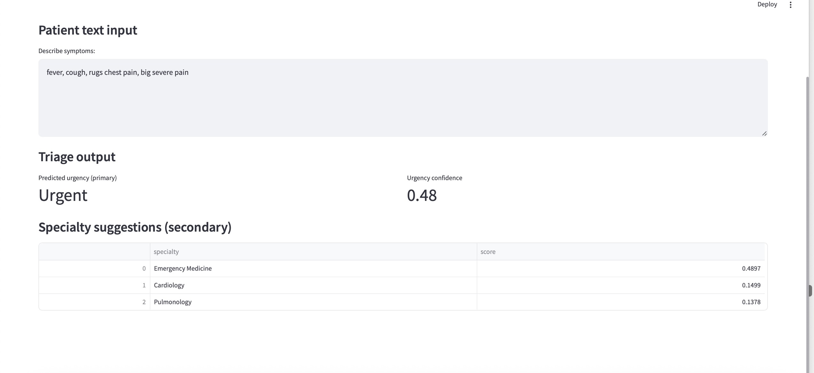
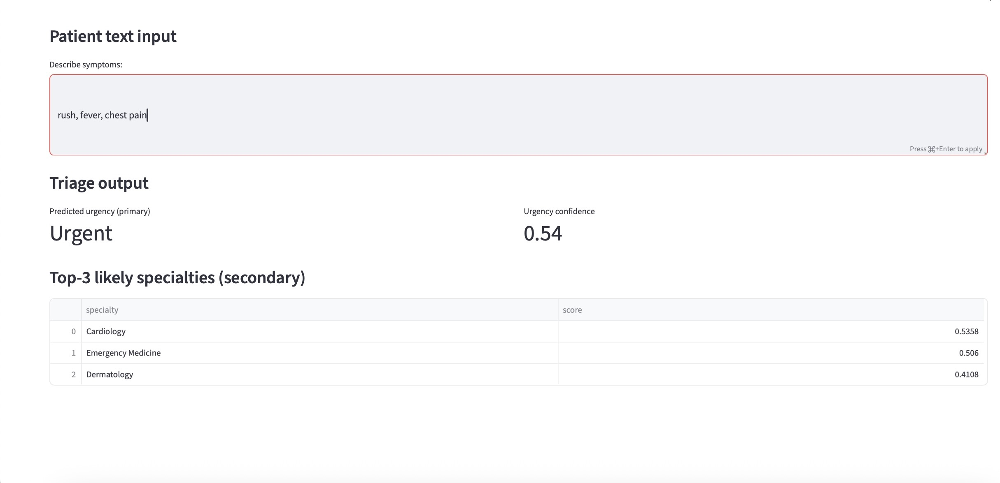

Why urgency classification works better than specialty prediction

While the model achieves strong performance for urgency classification, predicting the exact medical specialty proved significantly more challenging. This is primarily due to limitations of the dataset rather than the modeling approach.

## App Screenshot

Patient-reported symptom descriptions are often short, ambiguous, and lack sufficient clinical context, making it difficult to distinguish between closely related specialties (e.g., cardiology vs pulmonology). In contrast, urgency levels are more directly reflected in language intensity and severity cues (e.g., “severe pain”, “cannot breathe”), which are easier for models to capture.

Additionally, clinical NLP suffers from limited availability of high-quality, annotated datasets, especially for fine-grained tasks like specialty classification. Small and imbalanced datasets further reduce model performance, particularly for multi-class problems with overlapping symptom patterns.

Reducing the number of specialty classes (e.g., merging rare categories into an “Other” group) can partially improve performance, but does not fully resolve the issue due to the inherent ambiguity of the input data.

Recommended next steps include:
	•	using larger and more diverse clinical datasets,
	•	applying more powerful transformer models (e.g., full BERT or domain-specific variants),
	•	incorporating additional structured features (e.g., symptom duration, patient metadata),
	•	or reframing the task as specialty suggestion / ranking rather than strict classification.

As a result, while urgency can be reliably predicted, specialty classification in this setting is treated as a low-confidence suggestion rather than a definitive recommendation.
Dlaczego klasyfikacja urgency działa lepiej niż przewidywanie specjalisty

Model osiąga dobre wyniki dla klasyfikacji pilności (urgency), natomiast przewidywanie konkretnej specjalizacji medycznej okazało się znacznie trudniejsze. Wynika to głównie z ograniczeń datasetu, a nie samego podejścia modelowego.

Opisy objawów tworzone przez pacjentów są często krótkie, niejednoznaczne i pozbawione wystarczającego kontekstu klinicznego, co utrudnia rozróżnienie między zbliżonymi specjalizacjami (np. kardiologia vs pulmonologia). Natomiast poziom pilności jest częściej bezpośrednio widoczny w języku – poprzez intensywność i ciężkość objawów (np. „silny ból”, „nie mogę oddychać”), co modele łatwiej wychwytują.

Dodatkowo w medycznym NLP występuje problem ograniczonej liczby wysokiej jakości, oznaczonych danych, szczególnie dla zadań wymagających dokładnego rozróżniania wielu klas, takich jak specjalizacja lekarza. Małe i niezbalansowane zbiory danych dodatkowo pogarszają wyniki modeli, zwłaszcza przy problemach wieloklasowych z nakładającymi się objawami.

Zmniejszenie liczby klas (np. poprzez połączenie rzadkich specjalizacji w kategorię „Other”) może częściowo poprawić wyniki, ale nie rozwiązuje problemu w pełni ze względu na niejednoznaczność danych wejściowych.

Rekomendowane dalsze kroki:
	•	wykorzystanie większych i bardziej zróżnicowanych datasetów klinicznych,
	•	zastosowanie bardziej zaawansowanych modeli transformerowych (np. pełny BERT lub modele domenowe),
	•	dodanie dodatkowych cech strukturalnych (np. czas trwania objawów, dane pacjenta),
	•	lub zmiana podejścia na sugerowanie/ranking specjalizacji zamiast sztywnej klasyfikacji.

W rezultacie poziom pilności może być przewidywany wiarygodnie, natomiast specjalizacja powinna być traktowana jako sugestia o niskiej pewności, a nie jednoznaczna rekomendacja.

## Additional Experimental Conclusion (Specialty Modeling)

We tested specialty prediction under two evaluation regimes and observed split-dependent behavior:
- **Official split (HF train/validation):** specialty remains weak (`MCC = 0.000`, `kappa = 0.000`).
- **Custom stratified evaluation:** specialty becomes strong in-distribution (holdout `MCC = 0.976`; 5-fold CV mean `MCC = 0.955 +/- 0.027`).

This means the model can separate specialties when train/validation distributions are aligned, but robustness degrades under distribution/class mismatch.

In plain terms:
- it is **not** true that specialty is always impossible,
- but it is also **not** robust enough to trust as a single definitive label in all settings.

As a result, the safest product framing is:
- `urgency` as the primary, high-confidence output,
- `specialty` as top-K ranked suggestions (with confidence), not strict top-1 diagnosis.

### Project Outcome
- Specialty performance is highly sensitive to evaluation regime (robustness vs in-distribution).
- In-distribution specialty quality can be high with MiniLM + Logistic Regression.
- Under shift, specialty reliability drops sharply, so ranking/retrieval framing is preferred.

## Key Results (CV-ready)
- Built and compared multiple NLP pipelines for specialty prediction: MiniLM + Logistic Regression, MiniLM + LDA variants, and MiniLM + centroid similarity.
- Evaluated with robust multi-class metrics (`MCC`, `balanced_accuracy`, `f1_macro`, `top-3 accuracy`) instead of relying only on accuracy.
- Diagnosed a core data limitation: specialty labels are weakly separable, while urgency remains a stable and actionable target.
- Reframed the product direction from strict top-1 specialty prediction to top-K specialty suggestion.

## Business Takeaways
- For triage UX, prioritize `urgency` as the primary prediction and present `specialty` as ranked suggestions.
- Ranking/retrieval framing is safer clinically than forcing one definitive specialty label from ambiguous patient text.
- Future gains depend more on richer data and label design than on swapping classifiers.
